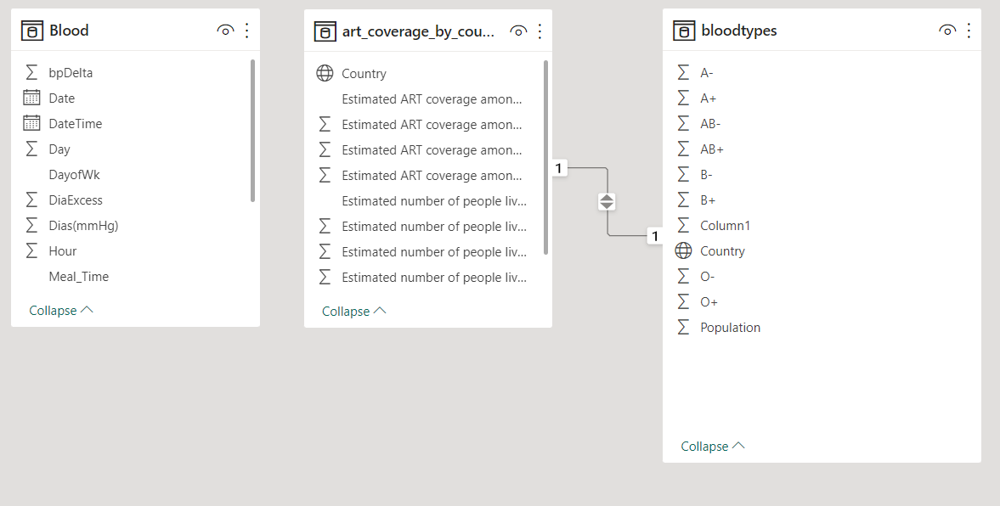
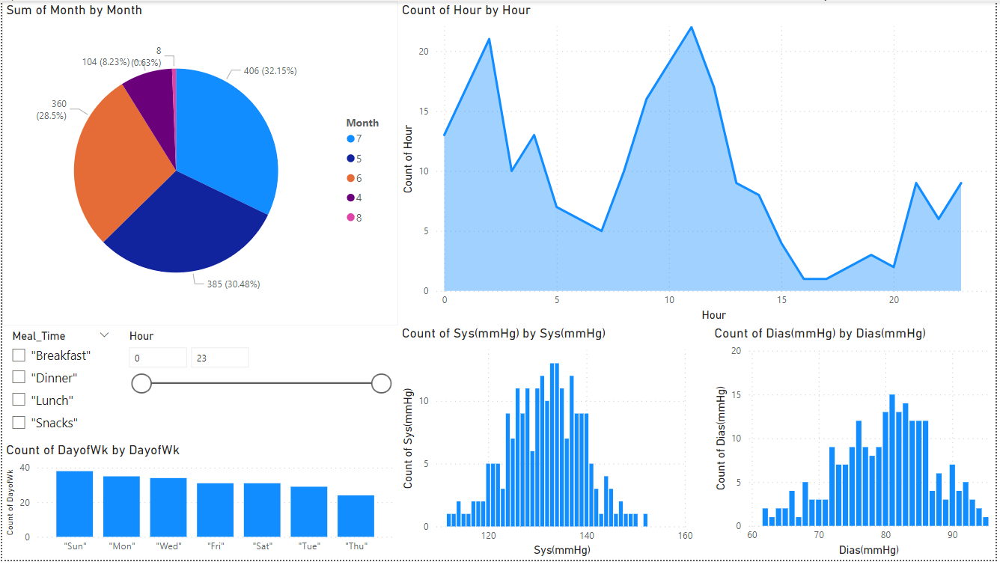
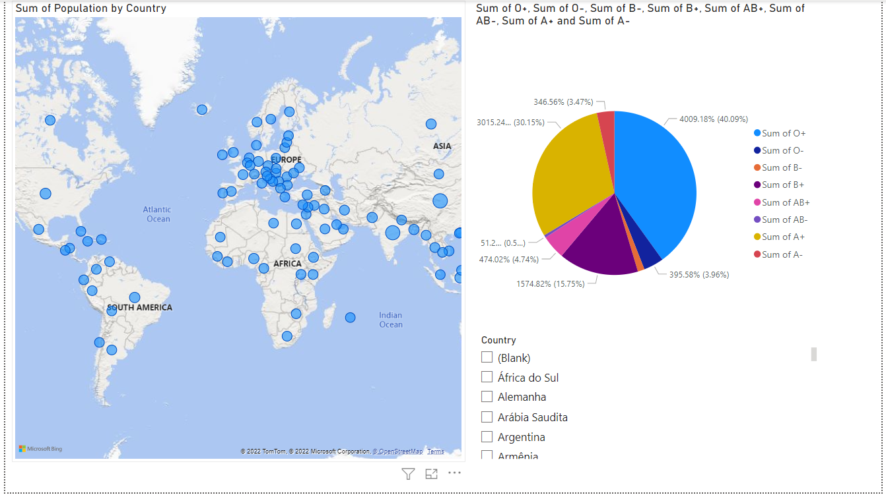
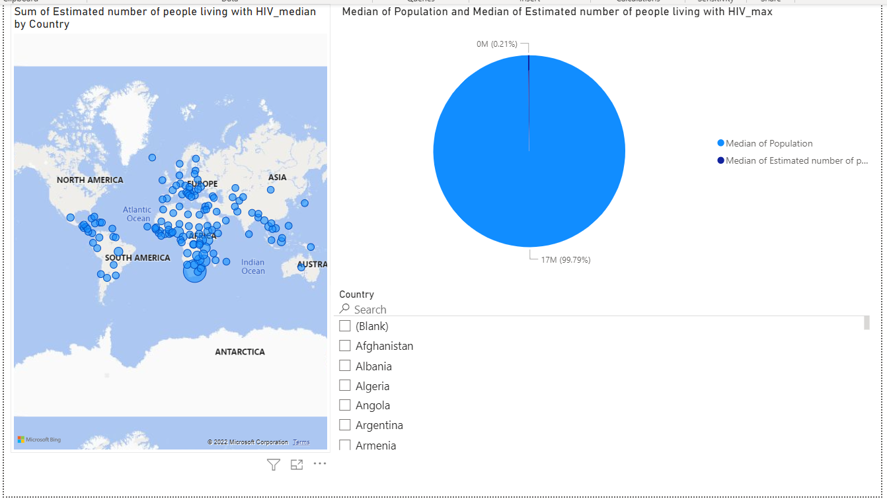

# Blood-Donation

---------------

# "Blood is the most precious gift that anyone can give to another person — the gift of life."

## World Health Organization

 Forecasting blood supply is a serious and recurrent problem for blood collection managers: in January 2019, "Nationwide, the Red Cross saw 27,000 fewer blood donations over the holidays than they see at other times of the year." Machine learning can be used to learn the patterns in the data to help to predict future blood donations and therefore save more lives.

<!--  -->

|     | Variable                                   | Explanation                                                                                                                              |
| --: | :----------------------------------------- | :--------------------------------------------------------------------------------------------------------------------------------------- |
|   0 | Recency (months)                           | **R** (Recency - months since the last donation)                                                                                             |
|   1 | Frequency (times                           | **F** (Frequency - total number of donation)                                                                                                 |
|   2 | Monetary (c.c. blood)                      | **M** (Monetary - total blood donated in c.c.)                                                                                               |
|   3 | Time (months)                              | **T** (Time - months since the first donation)                                                                                               |
|   4 | whether he/she donated blood in March 2007 | a binary variable representing whether he/she donated blood in March 2007 (1 stands for donating blood; 0 stands for not donating blood) |

__________________

:point_down:

__________________

__________________

**HIV**

